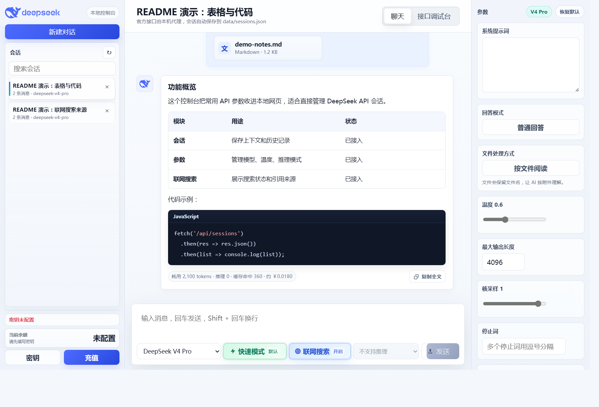
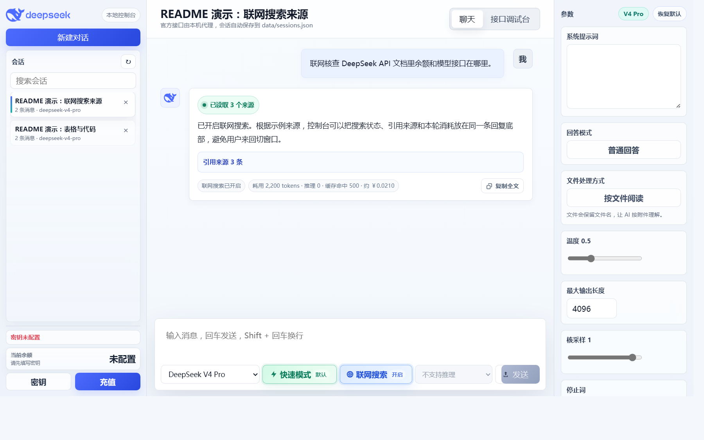

# DeepSeek API Console

一个本地运行的 DeepSeek API 可视化控制台，把常用接口能力做成接近网页端体验的聊天 UI。项目适合想直接使用 DeepSeek API、又不想手写大量接口参数的人：启动后可以在浏览器里管理会话、配置密钥、查看余额、切换模型与参数、阅读文件、展示联网搜索来源，并保留本地上下文记录。



## 功能亮点

- 多会话管理：支持新建、删除、切换会话，会话内容保存在本地。
- API Key 配置：可在界面左下角打开“密钥”弹窗，更换密钥并校验是否可用。
- 余额与充值：自动显示 DeepSeek 账户余额，并提供充值入口。
- 对话模式：支持快速模式、深度思考、推理强度、最大输出长度、温度等常用参数。
- 联网搜索：可在同一会话中随时开启或关闭，回答结束后展示搜索状态和引用来源。
- 本轮消耗：每条 AI 回复底部显示 token、推理 token、缓存命中和估算费用。
- 文件阅读：支持把文本类文件作为附件阅读，或直接并入消息发送。
- Markdown 渲染：支持标题、列表、表格、代码块、数学公式、文本图表和 Mermaid 图表。
- 代码高亮：常见语言和命令行片段会自动高亮，并带复制、下载等操作。
- API 调试台：保留接口调试入口，便于直接检查请求参数和返回结果。

## 界面截图

### 联网搜索来源



## 快速开始

安装依赖：

```bash
npm install
```

启动项目：

```bash
npm start
```

也可以在 Windows 上直接双击或运行：

```bat
start.bat
```

默认访问地址：

```text
http://localhost:3217
```

## 配置密钥

推荐直接在 UI 里配置：启动项目后，在界面左下角点击“密钥”，粘贴 DeepSeek API Key。系统会先校验密钥是否可用，校验通过后自动保存并立即生效，一般不需要手动编辑 `.env`。

`.env` 方式只作为备用方案，适合服务器部署、批量预置或不想打开界面配置的场景。可以复制 `.env.example` 为 `.env`，再填入自己的真实密钥：

```env
DEEPSEEK_API_KEY=your_deepseek_api_key_here
DEEPSEEK_BASE_URL=https://api.deepseek.com
DEEPSEEK_MODEL=deepseek-v4-pro
```

注意：`.env`、`data/sessions.json`、`node_modules/` 都是本地私有文件或运行产物，默认不会提交到仓库。

## 当前模型

项目界面保留的是当前已接入和可用的 DeepSeek API 模型入口：

- `deepseek-v4-pro`：质量优先，适合复杂推理和正式回答。
- `deepseek-v4-flash`：速度优先，适合轻量问答和快速草稿。

如果 DeepSeek 官方后续开放新的模型 ID，可以在后端模型列表和前端模型选择处继续补充。

## 项目结构

```text
.
├─ public/              # 前端页面、样式、脚本和本地渲染依赖
├─ data/                # 本地会话数据目录，真实会话 JSON 不提交
├─ server.js            # 本地 Node.js 服务与 DeepSeek API 转发
├─ package.json         # Node.js 依赖与启动脚本
├─ start.bat            # Windows 一键启动脚本
├─ .env.example         # 密钥配置模板
└─ README.md            # 项目说明
```

## 使用建议

- 普通问题使用快速模式，便宜且响应快。
- 数学、代码、长文分析等问题使用深度思考。
- 查询近期信息、官网文档、价格、新闻和政策时开启联网搜索。
- 涉及隐私的附件不建议上传到第三方 API；本项目只是本地读取文件内容并拼入请求。

## 许可证

本项目暂未声明开源许可证，仅作为个人本地工具维护；未经授权，请勿复制、分发或用于商业用途。
